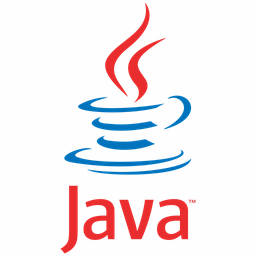
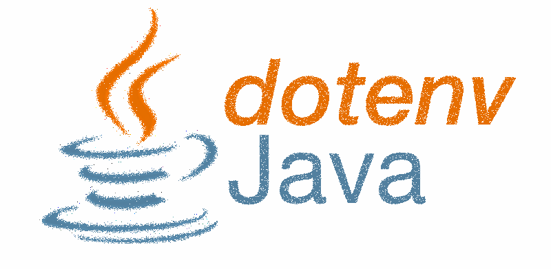
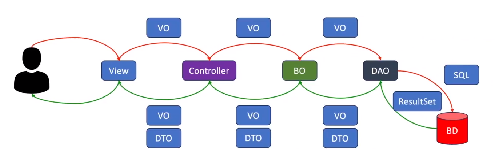

# Projeto da Oficina de Banco de Dados

O objetivo deste projeto é apresentar a forma para o desenvolvimento de uma aplicação Java, utilizando uma estrutura hierárquica de camadas, tendo por premissa a arquitetura MVC.

## 🎯 Índice

- [Visão Geral](#-índice)
- [Tecnologias Utilizadas](#-tecnologias-utilizadas)
- [Hierarquia de Pacotes](#hierarquia-de-pacotes)
- [Contribuição](#-contribuição)

---

## 🌐 Visão Geral

Este projeto foi desenvolvido com base na Oficina de BD do professor Adriano de Melo que leciona na instituição. Com a evolução projeto o intuito é demonstrar na prática para nossos alunos, o que, como e com quais ferramentas podemos implementar projetos Java.

- [Visão Geral](#-índice)
---

## 🛠 Tecnologias Utilizadas

* Java 17
* Maven 4.0
* MySQL 8.0
* Hierarquia de Pacotes
* Arquitetura MVC
* Dotenv para Java

|LOGO           |STACK                              |FUNÇÃO                       |
|---------------|-----------------------------------|-----------------------------|
|  | `Java 17` | Linguagem de programação escolhida para o desenvolvimento do Back-end da aplicação |
|  | `Maven 4.0.0` | Ferramenta de gerenciamento para o build de código-fonte (construção dos artefatos para sua execução), pois padroniza o gerenciamento de dependências, a execução dos testes, o build e deploy da aplicação |
|  | `MySQL 8.0.33` | Gerenciador de Banco de Dados de código aberto |
|  | `Hierarquia de Pacotes` | Organização dos diretórios (pastas do projeto) dentro de responsabilidades específicas para cada uma das entidades implementadas |
|  | `Recurso para Variáveis de Ambiente` | Configuração dos recursos conforme necessidade de cada ambiente, a exemplo de Dev / Stage / Homolog / Prod. Projeto open source e desenvolvido por [Carmine DiMascio](https://github.com/cdimascio) |

- [Visão Geral](#-índice)
---

## Hierarquia de Pacotes

Conceito relacionado ao conjunto de classes localizadas na mesma estrutura hierárquica de diretórios, geralmente agrupadas em pacotes comuns entre si, com o propósito de facilitar a reutilização de código.

```shell
.
└── OFICINABD/
    ├── assets/
    │   └── docs/
    ├── src/
    │   ├── main/
    │   │   └── java/br/com/lucianokogut/
    │   │       ├── controller
    │   │       ├── model
    │   │       │   ├── bo
    │   │       │   ├── dao
    │   │       │   └── vo
    │   │       ├── view
    │   │       └── Main.java
    │   └── test
    ├── Dockerfile
    ├── pom.xml
    └── README.md
```

A separação das camadas e dos pacotes em uma hierarquia MVC seguem o fluxo indicado abaixo.



Neste projeto estão em uso as sub-camadas do Model, para que sejam separadas as responsabilidades das classes:

1. `VO` - Pacote que mantém todas as classes que representam uma entidade do banco de dados, como um espelhamento do objeto principal que será trafegado de uma camada para outra.

2. `BO` - Pacote que mantém todas as classes que possuem as regras de negócios e interagem com os objetos trafegados, com o objetivo de validar todas as regras existentes para cada objeto.

3. `DAO` - Pacote que mantém todas as classes que preparam as querys para cada um das operações do CRUD, que acessam o banco de dados e executam as rotinas SQL no DB.

**As demais camadas do fluxo (View e Controller) serão utilizadas em projetos, que necessitem de um front-end acessando os dados desta parte da aplicação, que pode ser considerado um projeto inicial de back-end.**

Os pacotes da camada de modelo possuem as seguintes funções:

A camada VO representa as entidades (tabelas lá do banco de dados).
A camada BO representa os serviços que serão desenvolvidos para validação dos dados.
A camada DAO representa os repositórios que farão fisicamente o acesso ao BD, a persistência, a manipulação ou exclusão dos dados.

Fonte: https://tree.nathanfriend.io/

- [Visão Geral](#-índice)
---

## 🤝 Contribuição

Estamos dispostos a ouvir suas sugestões para o andamento das aulas e a interdisciplinariedade do curso.

Tendo alguma outra demanda, entre em contato com os professores Adriano ou Luciano.

[Adriano](adriano.melo@prof.sc.senac.br)

[Luciano](luciano.kogut@prof.sc.senac.br)

- [Visão Geral](#-índice)
---